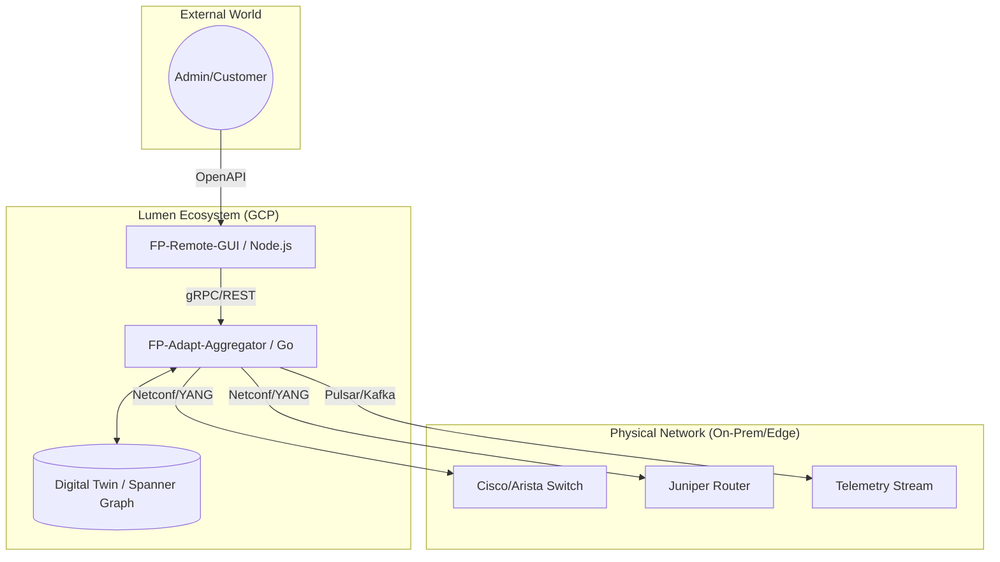

## High-Level Architecture
## 1. The Architectural Design: "Fabric-Port-as-a-Service"
Below is a high-level design using the Hexagonal Architecture (Ports and Adapters) pattern. This is the gold standard for Go and Node.js because it separates the business logic from the messy physical network.

# High-Level Component Flow
1. UI Layer (FP-Remote-GUI): A React/Node.js application where technicians or customers view port status.
2. Orchestration Layer (GCP): Where your logic lives. It validates requests (e.g., "Does this user have permission to increase bandwidth?").
3. Aggregation Layer (FP-Adapt-Aggregator): This is the critical engine. It "aggregates" thousands of raw status updates from physical switches and "adapts" them into a clean API format.

